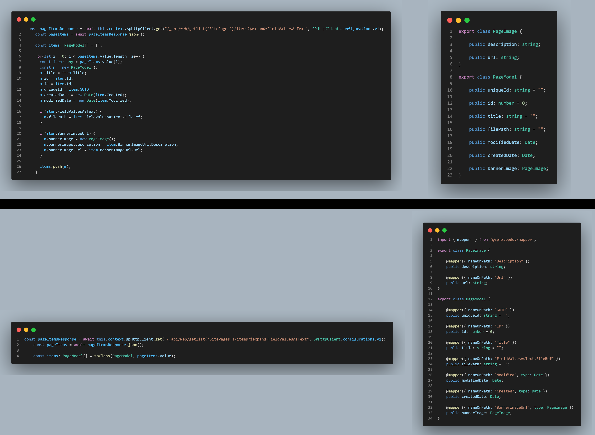

# @spfxappdev/mapper

  

The @spfxappdev/mapper library is a powerful npm package that simplifies the conversion of plain JavaScript objects into class instances and vice versa.
It is similar to the "Auto-Mapper" libraries in other languages. It is actually designed for the SharePoint (SPFx) development and OData REST API's, but can be used for any other project as well.
You can use this package for both the frontend and the backend.

- [Why to use the mapper package](#why-to-use-the-mapper-package)
- [Installation](#installation)
- [Methods](#methods)
   * [`toClass`](#toclass)
      + [Syntax](#syntax)
   * [`toPlain`](#toplain)
      + [Syntax](#syntax-1)
   * [`ConvertOptions`](#convertoptions)
- [Decorators](#decorators)
   * [`@mapper`](#mapper)
      + [`ConvertFunction`](#convertfunction)
- [Examples](#examples)

## Why to use the mapper package

In JavaScript, there are two kinds of objects:

- Plain objects: These are instances of the `Object` class. When created using curly braces `{}`, they're sometimes called literal objects (in TypeScript it is typically a `Record<Keys, Type>` Type).
- Class objects: These are instances of classes with their own defined constructor, properties, and methods. Typically, you create them using the `class` notation.

Modern web applications usually use a REST API and expect a plain (JSON) object for write accesses or return a plain object for read operations.

Sometimes you want to convert the plain object into your class because your class has better property names (in your opinion 😜) or additional methods or whatever. Or vice versa, you have a class instance and need to "send" a plain object with a different property name to the API to do something.

For example you have an API GET-Request that returns this JSON structure:

```typescript
[
    {
    "Id": 1,
    "Title": "Item 1",
    "SPFx_x0020_App_x0020_Dev_x0020_Status": "Done"
    },
    {
    "Id": 2,
    "Title": "Item 2",
    "SPFx_x0020_App_x0020_Dev_x0020_Status": "In Progress"
    },
    {
    "Id": 3,
    "Title": "Item 3",
    "SPFx_x0020_App_x0020_Dev_x0020_Status": "Not Started"
    }
]
```

> Note: As mentioned at the beginning of this document, this package is designed for SharePoint development and such ugly names as `SPFx_x0020_App_x0020_Dev_x0020_Status` are absolutely normal in SharePoint.

But you want to use your own defined class to use it in your code with nicer property names, like this:

```typescript
export class TaskItem {

    public id: number;

    public title: string;

    public status: string;

    public get isDone(): boolean {
        return this.status === "Done";
    }
}
```

Normally you would proceed like this:

```typescript
const allTaskItems: TaskItem[] = apiResult.map((item: any) => {
    const taskItem: TaskItem = new TaskItem();
    taskItem.id = item.Id;
    taskItem.title = item.Title;
    taskItem.status = item.SPFx_x0020_App_x0020_Dev_x0020_Status;
    return taskItem;
})
```

This is just a small and simple example. Imagine you have more properties or a conversion of types like number to string, string to date or nested properties.

And this is exactly when the mapper package should "join the game" 😁.

Simply adjust the (same) class as follows:

```typescript
import { mapper } from '@spfxappdev/mapper';

export class TaskItem {

    @mapper({ nameOrPath: 'Id' })
    public id: number;

    @mapper({ nameOrPath: 'Title' })
    public title: string;

    @mapper({ nameOrPath: 'SPFx_x0020_App_x0020_Dev_x0020_Status' })
    public status: string;

    public get isDone(): boolean {
        return this.status === "Done";
    }
}
```

And then use this:

```typescript
import { toClass } from '@spfxappdev/mapper';

const allTaskItems: TaskItem[] = toClass(TaskItem, apiResult);
```

And the result is the same as before. Easy, isn't it?

## Installation

```bash
npm i @spfxappdev/mapper
```

## Methods

### `toClass`

This method converts a plain javascript object to instance of specific class.

```typescript
import { toClass } from '@spfxappdev/mapper';

const allTaskItems: TaskItem[] = toClass(TaskItem, apiResult);
```

#### Syntax

```typescript
toClass(targetType: T, plainObject: any, options?: ConvertOptions);
```

- `targetType`: The type/class (parameterless constructor) that is created after the conversion
- `plainObject`: The "source" object / the plain (literal) object
- `options` Optional parameters of type `ConvertOptions` to be used for the conversion, such as rule name(s). See [ConvertOptions](#convertoptions)

> Note: If the plain object is an array, the return value is (automatically) an array of the specified type. Please do not pass the `targetType` as an `Array<T>` or `T[]`. The return type is automatically an array of `targetType`.

### `toPlain`

This method converts your class object back to plain object/array of plain objects.

```typescript
import { toPlain } from '@spfxappdev/mapper';

const plainObj: any = toPlain(allTaskItems);
```

#### Syntax

```typescript
toPlain(obj: T|T[], options?: ConvertOptions);
```

- `obj`: The "source" object/class (instance(s))
- `options` Optional parameters of type `ConvertOptions` to be used for the conversion, such as rule name(s). See [ConvertOptions](#convertoptions)


### `ConvertOptions`

The `ConvertOptions` type provides additional conversion options for the methods `toClass` and `toPlain`.

| Property            | Type   | Description   | Default Value |
|---------------------| ------ | ------------- | ------------- |
| `rules`             | `string` or `string[]` |  `OPTIONAL`: A string or an array of string values to define a rule name to be used during the conversion process. Only mapper decorators that also have this rule name(s) are then taken into the conversion process.     **IMPORTANT:** If the `excludeDefaultRule` option (default = `false`) is set to false, all mapper decorators that have not specified a `rule` property are also included.| - |
| `excludeDefaultRule`| `boolean` | `OPTIONAL`: If set to `true`, only mapper decorators that have this rule name(s) are included in the conversion process, otherwise all mapper decorators with the specified rule name(s) AND all mapper decorators that have not specified a `rule` property are included. | `false`       |


## Decorators

The decorators are helpful if you want to achieve a lot with less code and also fast. 

In order to better understand how decorators work, I recommend reading [this article](https://medium.com/google-developers/exploring-es7-decorators-76ecb65fb841). 

> **Simple definition**: An ES2016 decorator is an expression which returns a function and can take a target, name and property descriptor as arguments. You apply it by prefixing the decorator with an @ character and placing this at the very top of what you are trying to decorate. Decorators can be defined for either a class, a method or a property.

You can only use a single, but very important decorator from this package. This decorator gives the package its name, the `mapper` decorator.

### `@mapper`

The `@mapper` decorator can only be used for class properties. During the conversion process (`toPlain` or `toClass`), only properties that have the mapper decorator are considered. The decorator has a set of (Optional) options that can be passed to the decorator.

| Property            | Type   | Description   | Default Value |
| ------------------- | ------------- | ------ | ------------- |
| `nameOrPath`        | `string`  | Name or path for/from the property. If not specified, the property name of the class is used! When using the `toClass` method, the property is read from the plain object and set to the class object. When using the `toPlain` method, the property value of the class object is converted into the specified name or path of the plain object. **IMPORTANT**: If the name of your property contains a dot, you must set the mapper option `resolvePath` to `false`. | - |
| `resolvePath`       | `boolean` | Determines whether the specified `nameOrPath` option should be handled as a path (for nested objects) or not. **IMPORTANT** Set this value to `true` if your property name contains a dot. | `true` |
| `defaultValue`      | `any` | The default value of the class/plain object property if the specified `nameOrPath` option could not be found | - |
| `type`              | `constructor()` | Specifies a type of the class property. For primitive types (`number`, `string`, `boolean`) please use the classes `PrimitiveString`, `PrimitiveNumber` and `PrimitiveBoolean` from this package. If the specified type is a `DateTime`, it is tried to convert it to `DateTime`. It is recommended that the specified type also uses the `mapper` decorators. **IMPORTANT**: Only parameterless class constructors are supported | - |
| `convertFunc`       | `ConvertFunction` | This type is a user-defined conversion function when the `toClass` or `toPlain` method is executed for the specified property. In the function the `this.`-pointer can be used to access the class instance. See [ConvertFunction](#convertfunction) for more information. | - |
| `toClassOnly`       | `boolean` | Convert this property only when converting from plain to class instance. (= `toClass` only) | `false` |
| `toPlainOnly`       | `boolean` | Convert this property only when converting from class instance to plain object. (= `toPlain` only) | `false` |
| `rules`             | `string` or `string[]` | string or an array of string values for defining a rule name. The name of the rule(s) can be specified in the `toPlain` and `toClass` methods (see [ConvertOptions](#convertoptions)). This option should be used with multiple mapper decorators for the same property. For Example: If you use the same class for different API requests that return different property names, you can define rule names. During the conversion process, you can specify the name of the rule(s) to be used. Then the mapper knows which property name (and configuration) should be mapped to the target object. | - |

#### `ConvertFunction`

This type is a user-defined conversion function when the `toClass` or `toPlain` method is executed for the specified property. In the function the this.-pointer can be used to access the class instance.

| Property            | Type   | Description   |
| ------------------- | ------------- | ------ |
| `nameOrPath` | `string` | The specified `nameOrPath` property from decorator |
| `metaData` | `MapperMetadata` | The specified properties from decorator |
| `value` | `any` | The property value from `class` or `plain` object |
| `plainOrClassObj` | `any` | The `class` or `plain` object (the source object to be converted from) |
| `convertToClass` | `boolean` | `true` if the function was called from `toClass` method, otherwise `false` |

This function should return the new and converted property value.

## Examples

In the `examples` folder of this repository you will find some examples. But let me show you an example. This example is a typical flow in a SharePoint (SPFx) project.  


